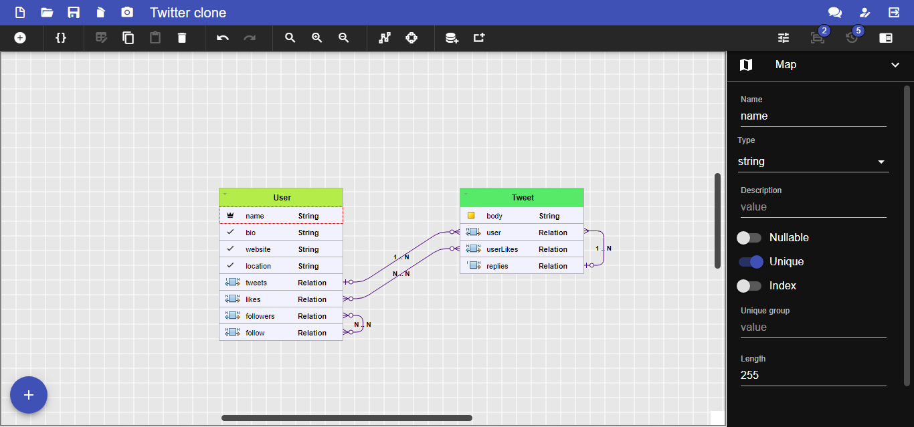

# Model First

[https://modelfirst.codegeniux.com/](https://modelfirst.codegeniux.com/)

## Features

* Screenshots

## Codegen Techs

* SQL 
  * 29 dialects and 76 code generators
* NoSQL
  * MongoDb V4.x
* CSharp
  * EF Core v6
* Java
  * Hibernate v5
  * JPA 2.1
* JavaScript
  * Sequelize V6
  * Knex
  * Bookshelf
  * Mongoose V5x
* JSON
  * Draft 07
  * Ajv schema
* PHP
  * Doctrine v2.8
  * Laravel v8
* Python
  * Django v3.2
  * SQLAlchemy v1.4
  * Pony
* Ruby
  * Rails 6
* TypeScript
  * MikroOrm v4.5
  * TypeORM MySQL
  * TypeORM Postgres
  * TypeORM Sqlite
  * TypeORM SqlServer
  * TypeORM CockroachDB
  * TypeORM Oracle
* Prisma schema
  * Sqlite
  * PostgreSQL
  * MySQL
  * SQL Server
* Visual Basic Script
  * MS Access MDB
  * MS Access ACCDB
* GraphQl
  * GraphQl Schema
* Swagger
  * Schema V2
  * Schema V3
* JHipster
  * Domain Language
* Graphics
  * GraphViz
  
## Todo

- [ ] Improve UI
- [ ] Real time collaboration 
- [ ] Mobile Version
- [ ] Import SQL DDL 
- [ ] Import existing code
- [ ] Import existing database
- [ ] Support inheritance
- [ ] Support migrations
- [ ] Support Cache Operations 
- [ ] Support Cascade Operations 
- [ ] Support JSON type
- [ ] Support Array type
- [ ] Support Enum type
- [ ] Support Embedded objects
- [ ] Allow group codegens as Tech stack

